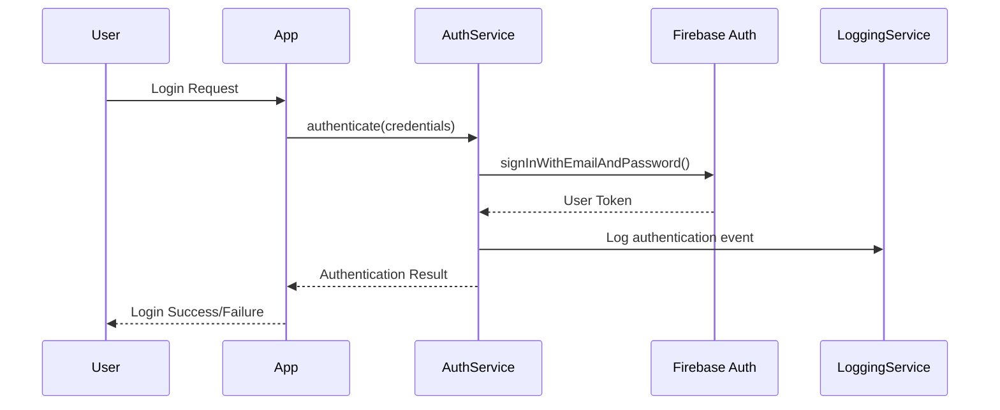
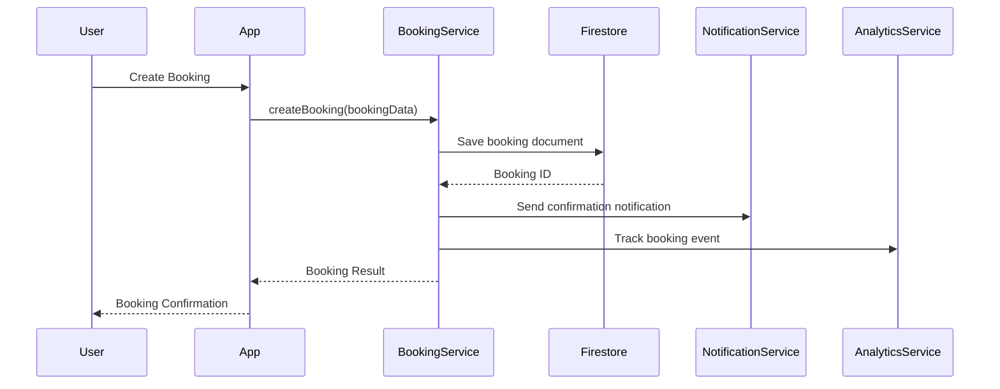
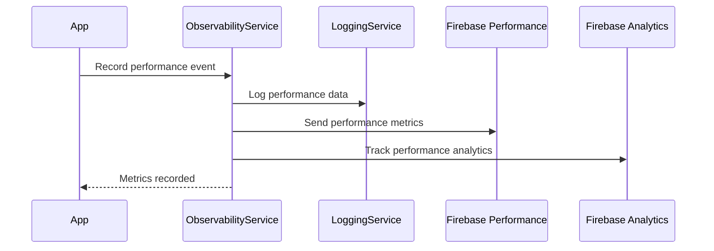

# Salas and Beats - Technical Architecture

## 📋 Table of Contents
- [Overview](#overview)
- [System Architecture](#system-architecture)
- [Technology Stack](#technology-stack)
- [Project Structure](#project-structure)
- [Core Services](#core-services)
- [Data Flow](#data-flow)
- [Security Architecture](#security-architecture)
- [Performance Architecture](#performance-architecture)
- [Deployment Architecture](#deployment-architecture)
- [Development Workflow](#development-workflow)
- [Quality Assurance](#quality-assurance)
- [Monitoring and Observability](#monitoring-and-observability)

## 🎯 Overview

Salas and Beats is a comprehensive Flutter-based mobile application for venue booking and event management. The application follows a clean architecture pattern with clear separation of concerns, implementing modern development practices including CI/CD, observability, and performance optimization.

### Key Characteristics
- **Cross-platform**: iOS, Android, and Web support
- **Scalable**: Microservices-ready architecture
- **Observable**: Comprehensive logging and monitoring
- **Performant**: Optimized for mobile and web platforms
- **Secure**: Enterprise-grade security implementation
- **Maintainable**: Clean code with extensive documentation

## 🏗️ System Architecture

### High-Level Architecture

```
┌─────────────────────────────────────────────────────────────┐
│                    Client Applications                       │
├─────────────────┬─────────────────┬─────────────────────────┤
│   iOS App       │   Android App   │      Web App            │
│   (Flutter)     │   (Flutter)     │    (Flutter Web)        │
└─────────────────┴─────────────────┴─────────────────────────┘
                            │
                            ▼
┌─────────────────────────────────────────────────────────────┐
│                  API Gateway Layer                          │
├─────────────────────────────────────────────────────────────┤
│  • Authentication & Authorization                           │
│  • Rate Limiting & Throttling                              │
│  • Request/Response Transformation                          │
│  • Load Balancing                                          │
└─────────────────────────────────────────────────────────────┘
                            │
                            ▼
┌─────────────────────────────────────────────────────────────┐
│                   Business Logic Layer                      │
├─────────────────┬─────────────────┬─────────────────────────┤
│   User Service  │ Booking Service │   Payment Service       │
│   • Profile     │ • Reservations  │   • Transactions        │
│   • Auth        │ • Availability  │   • Billing             │
│   • Preferences │ • Notifications │   • Refunds             │
└─────────────────┴─────────────────┴─────────────────────────┘
                            │
                            ▼
┌─────────────────────────────────────────────────────────────┐
│                    Data Layer                               │
├─────────────────┬─────────────────┬─────────────────────────┤
│   Firestore     │   Firebase      │   External APIs         │
│   • User Data   │   • Auth        │   • Payment Gateways    │
│   • Bookings    │   • Storage     │   • Maps & Location     │
│   • Venues      │   • Analytics   │   • Notifications       │
└─────────────────┴─────────────────┴─────────────────────────┘
```

### Application Architecture Pattern

The application follows **Clean Architecture** principles with the following layers:

1. **Presentation Layer** (`lib/screens/`, `lib/widgets/`)
   - UI components and screens
   - State management (Provider pattern)
   - User interaction handling

2. **Business Logic Layer** (`lib/providers/`, `lib/services/`)
   - Business rules and use cases
   - Service orchestration
   - Data transformation

3. **Data Layer** (`lib/models/`, `lib/services/`)
   - Data models and entities
   - Repository pattern implementation
   - External service integration

## 🛠️ Technology Stack

### Frontend
- **Framework**: Flutter 3.x
- **Language**: Dart 3.x
- **State Management**: Provider pattern
- **Navigation**: GoRouter
- **UI Components**: Material Design 3
- **Responsive Design**: Custom breakpoints

### Backend Services
- **Authentication**: Firebase Auth
- **Database**: Cloud Firestore
- **Storage**: Firebase Storage
- **Functions**: Firebase Cloud Functions (TypeScript)
- **Analytics**: Firebase Analytics + Custom Analytics Service
- **Monitoring**: Firebase Crashlytics + Custom Observability

### Development Tools
- **CI/CD**: GitHub Actions
- **Code Quality**: SonarQube, CodeQL
- **Testing**: Flutter Test, Integration Tests
- **Documentation**: Markdown, Mermaid diagrams
- **Dependency Management**: Dependabot

### Infrastructure
- **Hosting**: Firebase Hosting (Web)
- **CDN**: Firebase CDN
- **Monitoring**: Firebase Performance + Custom metrics
- **Security**: Firebase Security Rules

## 📁 Project Structure

```
lib/
├── config/                 # App configuration
│   ├── routes.dart         # Route definitions
│   └── theme.dart          # Theme configuration
├── models/                 # Data models
│   ├── booking.dart        # Booking entity
│   └── user.dart          # User entity
├── providers/              # State management
│   ├── auth_provider.dart  # Authentication state
│   ├── booking_provider.dart # Booking state
│   └── theme_provider.dart # Theme state
├── screens/                # UI screens
│   ├── auth/              # Authentication screens
│   ├── booking/           # Booking screens
│   ├── explore/           # Venue exploration
│   ├── host/              # Host management
│   ├── profile/           # User profile
│   └── settings/          # App settings
├── services/               # Business services
│   ├── analytics_service.dart    # Analytics tracking
│   ├── auth_service.dart         # Authentication
│   ├── booking_service.dart      # Booking management
│   ├── image_cache_service.dart  # Image optimization
│   ├── logging_service.dart      # Structured logging
│   ├── notification_service.dart # Push notifications
│   └── observability_service.dart # Performance monitoring
├── utils/                  # Utilities and helpers
│   ├── helpers.dart        # General utilities
│   ├── logger.dart         # Legacy logger
│   ├── performance_utils.dart # Performance utilities
│   └── routes.dart         # Route utilities
└── widgets/                # Reusable widgets
    ├── common/             # Common widgets
    │   ├── lazy_loading_widgets.dart # Performance widgets
    │   └── performance_widgets.dart  # Monitoring widgets
    ├── booking/            # Booking-specific widgets
    ├── chat/               # Chat widgets
    ├── host/               # Host widgets
    └── user/               # User widgets
```

## 🔧 Core Services

### Authentication Service
```dart
class AuthService {
  // Firebase Auth integration
  // Social login (Google, Apple, Facebook)
  // Email/password authentication
  // Phone number verification
  // Session management
}
```

### Logging Service
```dart
class LoggingService {
  // Structured logging with categories
  // Multiple log levels (debug, info, warning, error, critical)
  // Context-aware logging
  // Integration with external services
  // Performance tracking
}
```

### Observability Service
```dart
class ObservabilityService {
  // Performance monitoring
  // Custom metrics collection
  // Device information tracking
  // Memory usage monitoring
  // Screen load time tracking
}
```

### Analytics Service
```dart
class AnalyticsService {
  // Event tracking
  // User behavior analytics
  // Conversion funnel tracking
  // Custom event properties
  // Business metrics
}
```

### Image Cache Service
```dart
class ImageCacheService {
  // Intelligent image caching
  // Memory and disk management
  // Image compression
  // Lazy loading support
  // Performance optimization
}
```

## 🔄 Data Flow

### Authentication Flow


### Booking Flow


### Performance Monitoring Flow


## 🔒 Security Architecture

### Authentication & Authorization
- **Multi-factor Authentication**: Email, phone, biometric
- **Social Login**: Google, Apple, Facebook integration
- **Session Management**: Secure token handling
- **Role-based Access**: User, host, admin roles

### Data Security
- **Encryption**: End-to-end encryption for sensitive data
- **Firebase Security Rules**: Granular access control
- **Input Validation**: Comprehensive data validation
- **Secure Storage**: Encrypted local storage

### Network Security
- **HTTPS Only**: All communications encrypted
- **Certificate Pinning**: Enhanced connection security
- **API Rate Limiting**: DDoS protection
- **Request Validation**: Input sanitization

### Privacy
- **GDPR Compliance**: Data protection regulations
- **Data Minimization**: Collect only necessary data
- **User Consent**: Explicit permission for data usage
- **Data Retention**: Automatic cleanup policies

## ⚡ Performance Architecture

### Frontend Optimization
- **Lazy Loading**: On-demand content loading
- **Image Optimization**: Caching and compression
- **Code Splitting**: Modular loading
- **Bundle Optimization**: Minimal app size

### Caching Strategy
- **Multi-level Caching**: Memory, disk, and network
- **Cache Invalidation**: Smart cache management
- **Offline Support**: Local data persistence
- **Sync Strategy**: Background synchronization

### Performance Monitoring
- **Real-time Metrics**: FPS, memory, build times
- **Performance Overlay**: Debug information
- **Automated Alerts**: Performance degradation detection
- **Optimization Recommendations**: Actionable insights

## 🚀 Deployment Architecture

### Environments
- **Development**: Local development environment
- **Staging**: Pre-production testing
- **Production**: Live application

### CI/CD Pipeline

```mermaid
graph LR
    A[Code Push] --> B[GitHub Actions]
    B --> C[Code Quality Checks]
    C --> D[Automated Tests]
    D --> E[Security Scan]
    E --> F[Build Artifacts]
    F --> G[Deploy to Staging]
    G --> H[Integration Tests]
    H --> I[Deploy to Production]
    I --> J[Post-deployment Monitoring]
```


### Release Strategy
- **Feature Flags**: Gradual feature rollout
- **Blue-Green Deployment**: Zero-downtime releases
- **Rollback Strategy**: Quick reversion capability
- **Monitoring**: Post-deployment health checks

## 🔄 Development Workflow

### Git Workflow
- **Main Branch**: Production-ready code
- **Develop Branch**: Integration branch
- **Feature Branches**: Individual feature development
- **Release Branches**: Release preparation

### Code Quality
- **Linting**: Automated code style enforcement
- **Testing**: Unit, widget, and integration tests
- **Code Review**: Mandatory peer review
- **Documentation**: Comprehensive code documentation

### Development Tools
- **IDE**: VS Code with Flutter extensions
- **Debugging**: Flutter DevTools
- **Testing**: Flutter Test framework
- **Profiling**: Performance analysis tools

## 🧪 Quality Assurance

### Testing Strategy
- **Unit Tests**: Business logic validation
- **Widget Tests**: UI component testing
- **Integration Tests**: End-to-end scenarios
- **Performance Tests**: Load and stress testing

### Automated Testing
- **CI Integration**: Automated test execution
- **Test Coverage**: Minimum 80% coverage requirement
- **Regression Testing**: Automated regression detection
- **Cross-platform Testing**: iOS, Android, Web validation

### Manual Testing
- **User Acceptance Testing**: Business requirement validation
- **Usability Testing**: User experience validation
- **Accessibility Testing**: Inclusive design validation
- **Security Testing**: Vulnerability assessment

## 📊 Monitoring and Observability

### Application Monitoring
- **Performance Metrics**: Response times, throughput
- **Error Tracking**: Exception monitoring and alerting
- **User Analytics**: Behavior and engagement tracking
- **Business Metrics**: KPI and conversion tracking

### Infrastructure Monitoring
- **Resource Usage**: CPU, memory, storage
- **Network Performance**: Latency and bandwidth
- **Service Health**: Uptime and availability
- **Security Events**: Threat detection and response

### Alerting Strategy
- **Severity Levels**: Critical, warning, informational
- **Escalation Procedures**: Automated escalation paths
- **On-call Rotation**: 24/7 support coverage
- **Incident Response**: Structured response procedures

## 📈 Scalability Considerations

### Horizontal Scaling
- **Microservices**: Service decomposition
- **Load Balancing**: Traffic distribution
- **Auto-scaling**: Dynamic resource allocation
- **Database Sharding**: Data distribution

### Performance Optimization
- **Caching Layers**: Multi-level caching
- **CDN Integration**: Global content delivery
- **Database Optimization**: Query optimization
- **Resource Optimization**: Memory and CPU efficiency

### Future Enhancements
- **Machine Learning**: Personalization and recommendations
- **Real-time Features**: Live chat and notifications
- **Advanced Analytics**: Predictive analytics
- **IoT Integration**: Smart venue management

---

## 📚 Additional Documentation

- [API Documentation](./docs/API.md)
- [Deployment Guide](./docs/DEPLOYMENT.md)
- [Contributing Guidelines](./CONTRIBUTING.md)
- [Security Guidelines](./docs/SECURITY.md)
- [Performance Guidelines](./docs/PERFORMANCE.md)

---

**Last Updated**: December 2024  
**Version**: 1.0.0  
**Maintainers**: Development Team